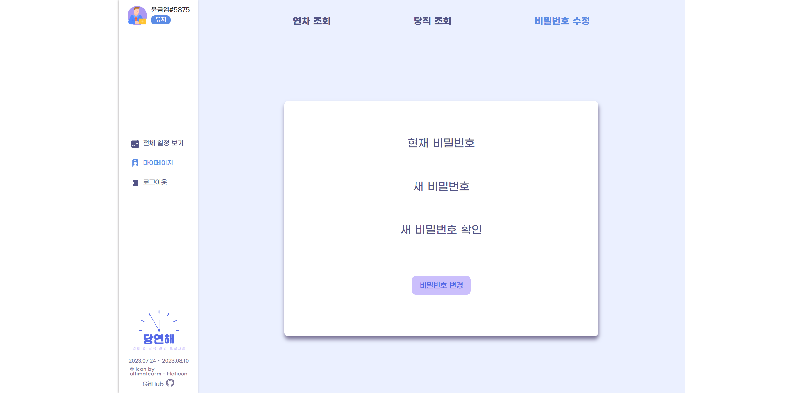
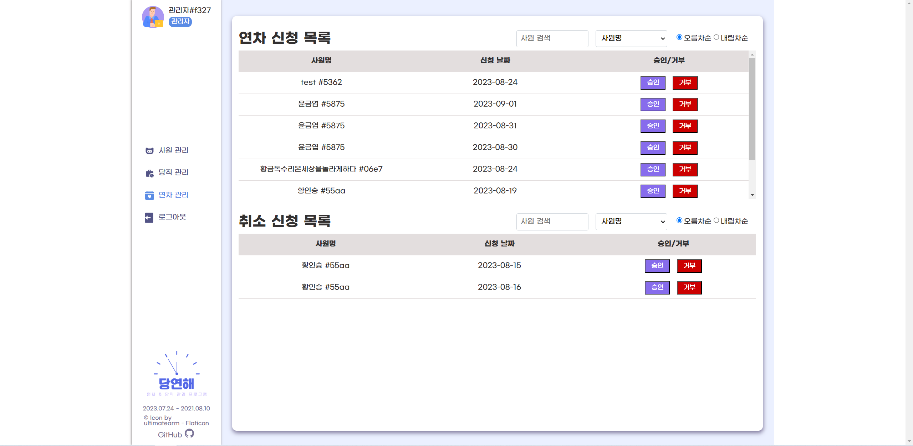

# 📑 당연해 (DangYeonHae)

<p>React, TypeScript, Rest API를 활용한 연차 / 당직 관리 웹사이트 입니다.</p>

## 📌 프로젝트 소개

> **패스트캠퍼스 프론트엔드 개발 부트캠프 5기**<br />
> **개발 기간** : 2023. 07. 24 ~ 2023. 08. 10<br />
> **배포 주소** : [당연해](https://dangyeonhae.netlify.app/)<br />
> **프론트엔드 레포지토리** : [프론트엔드](https://github.com/FAST-Mini-Project/front-end)<br />
> **백엔드 레포지토리** : [백엔드](https://github.com/FAST-Mini-Project/back-end)
<br />

## 📌 개발 팀원 및 역할

| <a href="https://github.com/ruddnjs3769"></a> | <a href="https://github.com/hwanginseung"></a> | <a href="https://github.com/DevYBecca"></a> | 
| :----------------------------------------------------------------------------------------------------------------------------------: | :-----------------------------------------------------------------------------------------------------------------------------------: | :-------------------------------------------------------------------------------------------------------------------------------------: | 
|                                                 [김경원](https://github.com/ruddnjs3769)                                                  |                                                 [황인승](https://github.com/hwanginseung)                                                  |                                                 [윤금엽](https://github.com/DevYBecca)
|                                                          GitHub 팀장<br /> 초기 개발 세팅<br /> 메인 페이지<br /> 로그인, 회원가입, 로그아웃<br /> Header                                                       |                                                        관리자 페이지<br /> (사원 관리, 연차 관리, 당직 관리)                                                          |                                                            마이 페이지<br /> (연차 조회, 당직 조회, 비밀번호 수정)                                                             

## 📌 사용 기술 및 개발 환경

### Development

<p>


<br />


</p>

### Config

<p>
</a>
</a>
</p>

### Deployment

</a>

### Environment

<p>
</a>
</a>
</a>
</p>

### Cowork Tools
<p>


</p>

<br />

## 📌 프로젝트 테스트

### clone project

```bash
$ git clone https://github.com/FAST-Mini-Project/front-end.git
```

### install npm

```bash
$ npm install
```

### start project

```bash
$ npm run dev
```

<br />


## 📌 프로젝트 상세 기능

### 1️⃣ 메인 페이지

#### HEADER
+ 유저 정보 + #사원번호 표시
+ NAVBAR 이용하여 메인/마이페이지/로그아웃 연결
+ 프로젝트 정보 및 저작권 정보 표시
#### Calendar
+ Fullcalendar 라이브러리 이용
+ 월 별 일정 조회 가능
+ 전체 연차 / 당직 일정 조회 : 모든 사원의 연차 / 당직 일정 조회 가능
+ 내 연차 / 당직 일정 조회 : 나의 연차 신청 현황 및 당직 일정 조회 가능
+ 연차 신청 : 날짜 클릭 시 모달 창 나타나며 해당 일자에 연차 신청 가능

#### Login / SignUp
+ 이메일, 비밀번호 입력 시 유효성 검사(이메일 형식(example@example.com), 비밀번호 형식(8자리 이상))
+ 유효성 검사 통과 못할 시 로그인 / 회원가입 버튼 비활성화
+ 회원가입 성공 시 로그인 페이지로 이동
+ 로그인 성공 시 관리자는 관리자 페이지, 일반사원은 메인페이지로 이동

### 2️⃣ 마이 페이지
- 연차 조회, 당직 조회, 비밀번호 수정 탭 메뉴 전환
#### 연차 조회
- 신청한 연차, 승인된 연차 조회 : 선택한 년도와 월에 따라 필터링  
  - 연차 신청 날짜가 오늘이 지나면 취소 버튼 비활성화(hover시 설명 출력)
- 년도에 맞게 잔여 연차 갯수 출력 : 신청, 승인 연차 갯수를 카운트하여 차감  
  - 년도가 변경될 경우 잔여 연차 갯수도 초기화(신청, 승인 연차가 있을 경우 계산 반영)
- 신청한 연차 리스트에서 취소 버튼 클릭 : 즉시 연차 신청 취소
- 승인된 연차 리스트에서 취소 버튼 클릭 : 관리자에게 연차 취소 신청 전달   
  - 관리자 승인을 거쳐야만 연차 취소가 완료됨

#### 당직 조회
- 예정된, 완료된 당직 조회 : 선택한 년도와 월에 따라 필터링
- 예정된 당직 일정과 완료한 당직 일정 분류 : 오늘 날짜가 지나면 완료 일정으로 자동 이동  
  - 완료된 당직 일정은 비활성화(hover시 설명 출력)
#### 비밀번호 수정
- 현재 비밀번호, 새 비밀번호, 새 비밀번호 확인 입력 필요
- 새 비밀번호와 새 비밀번호 확인이 일치해야만 비밀번호 수정 가능
- 비밀번호 수정 완료 시 로그인 페이지로 이동  
  - 다시 로그인해서 token을 받아야 함
- 유효성 검사
  - 수정 요청을 한 사원의 email 형식
  - 비밀번호는 8자리 이상 입력해야 함
### 3️⃣ 관리자 페이지
+ 관리자 아이디 외 접근불가 
 - 접근시 로그인 페이지로 이동
  
#### 사원 관리
+ 사내 모든 사원 리스트 출력
+ 사원명, 이메일, 잔여 연차, 당직 근무일 수 출력
+ 사원명 검색 기능
+ 사원명, 잔여 연차, 당직 근무일 수로 정렬 가능
+ 10명씩 pagenation
  
#### 당직 관리
+ 당직 근무자 캘린더 형식으로 출력
+ 달력 일일 칸에 근무자 출력, 근무 취소 기능
+ 해당 일 클릭시, 당직 근무자 설정 가능
+ 오늘 이전 날짜의 당직 근무자는 변경 불가능
  
#### 연차 관리
+ 연차 신청 목록, 취소 신청 목록 2가지 목록 출력
+ 연차 신청 목록 
  - 연차를 신청한 사원명, 연차 날짜 출력, 관리자가 연차의 승인/거부 가능
+ 취소 신청 목록 
  - 승인된 연차를 사원이 변경 신청을 한 경우 
    사원명, 연차 날짜 출력, 관리자가 취소신청의 승인/거부 가능
+ 사원명 검색 기능
+ 사원명, 날짜별 정렬 기능


### 기타 기능
+ uuid 사용하여 중복 없는 사원번호 생성
+ 일반 유저 또는 로그인 정보 없을 때 admin 페이지 접근 불가(PrivateRoute)
+ 로그인 정보 없을 때 main/mypage 접근 불가

## 📌 프로젝트 구조
<details>
  <summary>보기</summary>

  ```
📦 DangYeonHae
├─ .eslintrc.cjs
├─ .gitignore
├─ .prettierignore
├─ .prettierrc
├─ index.html
├─ package-lock.json
├─ package.json
├─ public
│  ├─ favicon.ico
│  ├─ free-icon-calendar-2738431.png
│  ├─ free-icon-employee-3043585.png
│  ├─ logo.png
│  └─ readme
│     ├─ admin_annuals.png
│     ├─ admin_duties.png
│     ├─ admin_dutymodal.png
│     ├─ admin_users.png
│     ├─ login.png
│     ├─ main_all.png
│     ├─ main_annualmodal.png
│     ├─ main_personal.png
│     ├─ mypage_annual.png
│     ├─ mypage_duty.png
│     └─ mypage_info.png
├─ readme.md
├─ src
│  ├─ App.tsx
│  ├─ _variables.scss
│  ├─ api
│  │  ├─ admin
│  │  │  └─ index.ts
│  │  ├─ index.ts
│  │  ├─ main
│  │  │  └─ index.ts
│  │  ├─ mypage
│  │  │  └─ index.ts
│  │  └─ user
│  │     └─ index.ts
│  ├─ components
│  │  ├─ adminfilter
│  │  │  ├─ AdminFilter.tsx
│  │  │  └─ AdminFilters.module.scss
│  │  ├─ adminwork
│  │  │  ├─ AdminWork.module.scss
│  │  │  └─ AdminWork.tsx
│  │  ├─ common
│  │  │  ├─ MainHeader.module.scss
│  │  │  └─ MainHeader.tsx
│  │  ├─ loginSignupRegex
│  │  │  ├─ regexValid.module.scss
│  │  │  └─ regexValid.tsx
│  │  ├─ main
│  │  │  ├─ AnnualApplyModal.module.scss
│  │  │  ├─ AnnualApplyModal.tsx
│  │  │  ├─ CalendarForm.module.scss
│  │  │  └─ CalendarForm.tsx
│  │  ├─ mypage
│  │  │  ├─ ApprovedAnnual.module.scss
│  │  │  ├─ ApprovedAnnual.tsx
│  │  │  ├─ CompletedDutyList.module.scss
│  │  │  ├─ CompletedDutyList.tsx
│  │  │  ├─ MenuTab.module.scss
│  │  │  ├─ MenuTab.tsx
│  │  │  ├─ MonthRange.module.scss
│  │  │  ├─ MonthRange.tsx
│  │  │  ├─ PlannedDutyList.module.scss
│  │  │  ├─ PlannedDutyList.tsx
│  │  │  ├─ RemainingAnnual.module.scss
│  │  │  ├─ RemainingAnnual.tsx
│  │  │  ├─ RequestedAnnual.module.scss
│  │  │  └─ RequestedAnnual.tsx
│  │  ├─ pagination
│  │  │  ├─ Pagination.module.scss
│  │  │  └─ Pagination.tsx
│  │  └─ sidebar
│  │     ├─ SideBar.module.scss
│  │     └─ SideBar.tsx
│  ├─ custom.d.ts
│  ├─ index.scss
│  ├─ index.tsx
│  ├─ layout
│  │  ├─ AdminLayout.tsx
│  │  ├─ AdminPrivateRouteWrapper.tsx
│  │  ├─ MainLayout.module.scss
│  │  └─ MainLayout.tsx
│  ├─ pages
│  │  ├─ admin
│  │  │  ├─ AdminAnnual.module.scss
│  │  │  ├─ AdminAnnual.tsx
│  │  │  ├─ AdminDuty.module.scss
│  │  │  ├─ AdminDuty.tsx
│  │  │  ├─ AdminEmployee.module.scss
│  │  │  └─ AdminEmployee.tsx
│  │  ├─ login
│  │  │  ├─ LogIn.module.scss
│  │  │  ├─ LogIn.tsx
│  │  │  ├─ SignUp.module.scss
│  │  │  └─ SignUp.tsx
│  │  ├─ main
│  │  │  ├─ Main.module.scss
│  │  │  └─ Main.tsx
│  │  └─ mypage
│  │     ├─ MyAnnual.module.scss
│  │     ├─ MyAnnual.tsx
│  │     ├─ MyDuty.module.scss
│  │     ├─ MyDuty.tsx
│  │     ├─ MyInfo.module.scss
│  │     ├─ MyInfo.tsx
│  │     ├─ MyPage.module.scss
│  │     └─ Mypage.tsx
│  ├─ types
│  │  ├─ AccessTypes.ts
│  │  ├─ AdminTypes.ts
│  │  ├─ MainTypes.ts
│  │  └─ MypageTypes.ts
│  ├─ utils
│  │  ├─ SortedData.ts
│  │  ├─ UserPrivateRoute.tsx
│  │  ├─ constants
│  │  │  └─ regex.ts
│  │  ├─ cookie.ts
│  │  └─ handleLogout.ts
│  └─ vite-env.d.ts
├─ tsconfig.json
├─ tsconfig.node.json
└─ vite.config.ts
```
</details>


## 📌 구현 화면
| 로그인 페이지 | 메인 페이지(전체 연차/당직 조회) |
| ------------------ | -------------------- |
|           |             |

| 메인 페이지(개인 연차/당직 조회) | 메인 페이지(연차 신청) |
| ----------------------------- | ------------------------------- |
|                      |                        |

| 마이 페이지(연차 조회) | 마이 페이지(당직 조회) |
| ----------------------------- | ------------------------------- |
|                      |                        |

| 마이 페이지(비밀번호 수정) | 관리자 페이지(사원 관리) |
| ------------------- | --------------------- |
|            |              |

| 관리자 페이지(당직 관리) | 관리자 페이지(당직 지정) |
| ------------------- | --------------------- |
|            |              |

| 관리자 페이지(연차 관리) |
| ------------------- | 
|            |